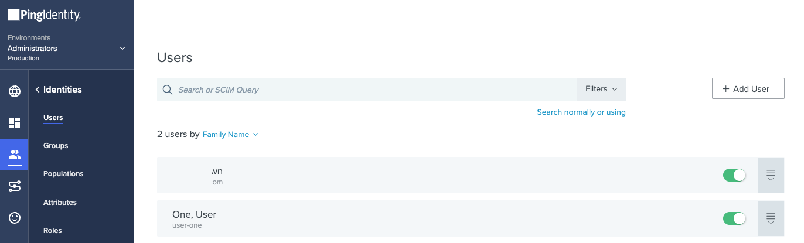

# How To Configure Ping Identity for NGINX Plus OIDC Integration

Take the following steps to create a new application of Ping Identity for integrating with NGINX Plus.

> **Note:**
>
> This guide uses the GUI provided with PingOne for Enterprise. It reflects the GUI at the time of initial publication, but the GUI is subject to change. The PingFederate user interace might also differ. Use this guide as a reference and adapt as necessary for the UI you are using.

- [Create a New Application](#create-a-new-application)
- [Configure Auth Code or PKCE Flow](#configure-auth-code-or-pkce-flow)
  - [Option 1. Configure Auth Code Flow](#option-1-configure-auth-code-flow)
  - [Option 2. Configure PKCE Flow](#option-2-configure-pkce-flow)

## Create a New Application

Create a new application for NGINX Plus:

1. Log in to your Ping Identity account. The administrative dashboard opens automatically. In this guide, we show the PingOne for Enterprise dashboard, and for brevity refer simply to ”PingOne”.

2. Click **Connections** in the left menu, and click **+ Application** button.

   
   

3. Type a name in the **Application Name** field and a description in **Description** field. Here, we’re using _`nginx-plus-oidc`_ and _`NGINX Plus OIDC Application`_. Choose a **OIDC Web App** in **Application Type**. Click the **Save** button.

   

## Configure Auth Code or PKCE Flow

Take the following steps to configure either Auth Code or PKCE.

- Select one of applications that you created. (`nginx-plus-oidc`).
- Click **Configuration** tab, and clidk **/** icon to edit details.

### Option 1. Configure Auth Code Flow

Take the following steps if you do not want to enable **PKCE**.

- Choose **OPTIONAL** in the drop box of **PKCE Enforcement**.
- Select an option of **Client Secret Post** in the radio button under the **Token Endpoint Authentication Method**
- Click **Save** button.

### Option 2. Configure PKCE Flow

Take the following steps if you want to enable **PKCE**.

- Choose **S256_REQUIRED** in the drop box of **PKCE Enforcement**.
- Do not choose **Client Credentials** in **Grant Type**.
- Select an option of **None** in the radio button under the **Token Endpoint Authentication Method**
- Click **Save** button.

## Configure Redirect URIs for Login and Logout

- In the **Redirect URIs**, type the URI of the NGINX Plus instance including the port number, and ending in `/_codexch`. Here we’re using **`https://nginx.pingidentity.test:17000/_codexch`** (the full value is not visible in the screenshot).

  

- In the **Signoff URLs**, type the URI of the NGINX Plus instance including the port number, and ending in `/_logout`. Here we’re using **`https://nginx.pingidentity.test:17000/_logout`**.

  

   

  > **Notes:**
  >
  > - For production, we strongly recommend that you use SSL/TLS (port 443).
  > - The port number is mandatory even when you’re using the default port for HTTP (80) or HTTPS (443). But it it isn't needed if you use NGINX ACM.

## Configure Scopes

- Click **Resources** tab.

  

- Click **/** icon, add `profile` and `email`, and click **Save** button:

  

- Check if **ALLOWED SCOPES** are configured with `profile`, `email`, and `openid`:

  

## Enable Application

You are returned to the **Applications** window, which now includes a row for **nginx-plus-oidc** application. Click the toggle switch at the right end of the row to the “on” position, as shown in the screenshot. Then click the “expand” icon at the end of the row, to display the application’s details.

## Make Note of Environment ID and Client ID

On the page that opens, make note of the values in the following fields on the Details tab. You will add them to the NGINX Plus configuration in Step 4 of Configuring NGINX Plus.

- **Environment ID** (in the screenshot, `de35baa5-xxxx-xxxx-xxxx-xxxxxxxxxxxx`)
- **Client ID** (in the screenshot, `1ce29830-xxxx-xxxx-xxxx-xxxxxxxxxxxx`)

### Option 1. Auth Code Flow: Note Client Secret

- **Client Secret** (in the screenshot, `YLHOdOHDgM...`); click on the eye icon to view the actual value (This is for **Auth Code** Flow), and note the value.

### Option 2. PKCE Flow: Skip Client Secret

- **Client Secret**: Don't need to note this for NGINX Plus PKCE.

## Add User

- Choose **Identities** menu from the left window.

  

- Click **Users** menu, and click **Add User** button.

  

- Add user information in the window of **Add User**.

  

- Check if new user is added.

  
